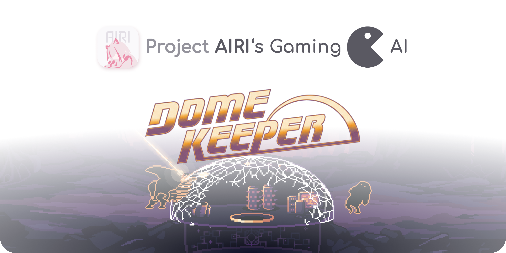

<p align="center">
  
</p>

<h1 align="center">Game AI - Dome Keeper</h1>

> This project is part of Project AIRI. We aim to build a LLM‑driven digital companion that can play games and interact with the world.
> Learn more at [Project AIRI](https://github.com/moeru-ai/airi) and the [AIRI live demo](https://airi.moeru.ai).

AI plays the game **Dome Keeper** with CV & LLM combined. Powered by YOLO.

## Models

| Name | Purpose | Base | Release |
| --- | --- | --- | --- |
| Entities | player/dome/ore/enemy detection | YOLO26n | WIP |

## Reproduce

### 1. Mod + Data Collection

1. Clone and install dependencies.

```bash
git clone https://github.com/AIRI-Dome-Keeper/airi-dome-keeper.git
cd airi-dome-keeper
bun install
```

2. Decompile the game.

Please follow the [modding rules](https://github.com/DomeKeeperMods/Docs/wiki/Getting-Started#modding-intro-and-rules). We assume you already own the game.

Download GDRETools from [gdsdecomp releases](https://github.com/GDRETools/gdsdecomp/releases) and set env vars:

```bash
export DOMEKEEPER_GAME_DIR="/path/to/Dome Keeper"
export GODOT_BIN="/path/to/Godot"
export GDRETOOLS_BIN="/path/to/gdre_tools"
export DOMEKEEPER_VERSION="4.2.2"
```

PowerShell:

```powershell
$env:DOMEKEEPER_GAME_DIR = "C:\Path\To\Dome Keeper"
$env:GODOT_BIN = "C:\Path\To\Godot.exe"
$env:GDRETOOLS_BIN = "C:\Path\To\gdre_tools"
$env:DOMEKEEPER_VERSION = "4.2.2"
```

Then run:

```bash
bun run decompile
```

3. Open the decompiled project.

```bash
bun run godot:open
```

4. Collect a dataset session.

- In the pause menu, click **YOLO Collect** to start/stop.
- Each session is stored under `user://yolo_data/session_<timestamp>/`.
- Outputs include `images/`, `labels/`, and `data.yaml`.
- Frames are letterboxed to `640×640` with gray padding.
- Session data is split into `train/val/test` by time segments (30s each, cycling 4/1/1).

### 2. Train a Baseline (Ultralytics)

We use the Ultralytics CLI (`yolo`) for training and export.

```bash
yolo detect train data=/path/to/session/data.yaml model=yolo26n imgsz=640
```

## Technical Reports

### Data Collection

- In‑game Godot mod adds a pause‑menu toggle and auto‑labels frames.
- Label transform handles view‑to‑texture scale mismatch and letterbox padding.

## Development

```bash
bun install
```

## Note

- **macOS rendering**: set `renderer/rendering_method="forward_plus"` in `project.godot` if you see crashes.
- **GDScript IntelliSense**: install [Godot Tools](https://marketplace.visualstudio.com/items?itemName=geequlim.godot-tools) and configure `godotTools.editorPath.godot4` in a local workspace file.

```json
{
  "folders": [{ "path": "." }],
  "settings": {
    "godotTools.editorPath.godot4": "/path/to/Godot.app"
  }
}
```

## Citation

If you find our works useful for your research, please consider citing:

```
@misc{airi_dome_keeper_2026,
  title        = {Game AI - Dome Keeper},
  author       = {Project AIRI Team},
  howpublished = {\url{https://github.com/AIRI-Dome-Keeper/airi-dome-keeper}},
  year         = {2026}
}
```

## About

AI plays the game Dome Keeper with CV & LLM combined. Powered by YOLO.
