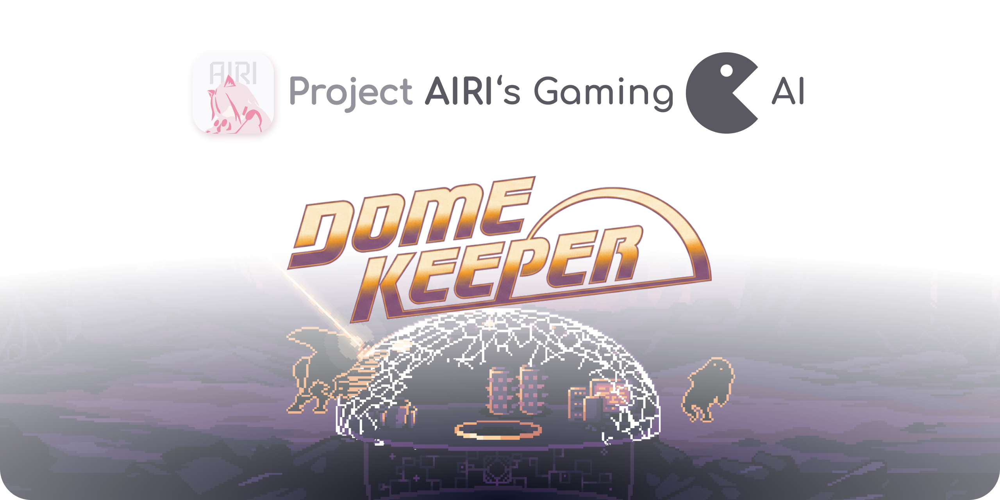

<p align="center">
  
</p>

<h1 align="center">Game AI - Dome Keeper</h1>

> This project is part of Project AIRI. We aim to build a LLM‑driven digital companion that can play games and interact with the world.
> Learn more at [Project AIRI](https://github.com/moeru-ai/airi) and the [AIRI live demo](https://airi.moeru.ai).

AI plays the game **Dome Keeper** with CV & LLM combined. The active replacement
AI mod is authored in TypeScript and converted to GDScript for Godot. The legacy
YOLO collector and rule-teacher source is retained but temporarily disabled.

## Models

| Name | Purpose | Base | Release |
| --- | --- | --- | --- |
| Entities | player/dome/ore/enemy detection | YOLO26n | WIP |

## Reproduce

Install [mise](https://mise.jdx.dev/installing-mise.html) before setting up the
repository.

### 1. Mod Development

1. Clone, install the pinned tools, and install locked dependencies.

```bash
git clone https://github.com/project-airi/game-playing-ai-dome-keeper.git
cd game-playing-ai-dome-keeper
mise install
mise run setup
```

2. Decompile the game.

Please follow the [modding rules](https://github.com/DomeKeeperMods/Docs/wiki/Getting-Started#modding-intro-and-rules). We assume you already own the game.

The [official Dome Keeper Editor 5.1](https://github.com/DomeKeeperMods/Docs/releases/tag/5.1)
(Godot 4.3.1 custom build) is installed and locked by mise. The pinned editor
supports macOS arm64/x64, Linux x64, and Windows x64. Keep the complete extracted
bundle intact because its Steam and multiplayer libraries are required at runtime.
Download GDRETools from [gdsdecomp releases](https://github.com/GDRETools/gdsdecomp/releases)
and set the remaining machine-local inputs:

```bash
export DOMEKEEPER_GAME_DIR="/path/to/Dome Keeper"
export GDRETOOLS_BIN="/path/to/gdre_tools"
```

PowerShell:

```powershell
$env:DOMEKEEPER_GAME_DIR = "C:\Path\To\Dome Keeper"
$env:GDRETOOLS_BIN = "C:\Path\To\gdre_tools"
```

Then run:

```bash
mise run decompile
```

The decompile workflow links only `DataCollectorAI`; the old
`YoloDataCollector` remains disabled. DataCollectorAI's TypeScript source is
under `mods/LemonNekoGH-DataCollectorAI/src/`. The decompile, Godot open, and
Godot check tasks build its generated GDScript before loading the Mod.

See its [README](mods/LemonNekoGH-DataCollectorAI/README.md) for the planner,
task, and `Quark Action` structure.

3. Open the decompiled project.

```bash
mise run godot:open
```

The legacy pause-menu collection and replay workflows are unavailable while the
old Mod is disabled. The former ViDot loopback WebSocket RPC gameplay and movie
proofs have also been removed so that transport is not retained as the target
design. Their basic Godot and ViKeeper fixture assets remain in the repository,
but they are not runnable until the Godot-native adapter is implemented. Use
`mise run godot:check` for the current DataCollectorAI Mod-load validation.

### 2. Train a Baseline (Ultralytics)

We use the Ultralytics CLI (`yolo`) for training and export.

```bash
mise run train data=/path/to/session/data.yaml model=yolo26n imgsz=640
```

## Technical Reports

### Legacy Data Collection

- The retained YOLO Mod adds a pause-menu toggle and auto-labels frames when it
  is explicitly re-enabled.
- Its label transform handles view-to-texture scale mismatch and letterbox
  padding. This workflow is currently inactive.

## Development

```bash
mise install
mise run setup
mise run check
```

`mise install` uses the committed `mise.lock`. After changing a tool version or
release asset in `mise.toml`, run `mise lock` and commit both files together.
The Dome Keeper Editor assets are pinned to the SHA-256 digests published by the
official GitHub release; review URL, digest, and asset-size changes together.

mise owns development-tool versions, including Node.js and pnpm, and
repository-level tasks. pnpm owns JavaScript and TypeScript workspace
dependencies through `pnpm-workspace.yaml`, `package.json`, and
`pnpm-lock.yaml`; this includes the TypeScript-authored Godot mod under
`mods/*`. uv owns Python
dependencies and the project environment through `pyproject.toml`, `uv.lock`,
and `.venv`. Run Python tools through `uv run` or a mise task rather than using
bare `python`, `pip`, or `yolo` commands.

## Note

- **macOS rendering**: set `renderer/rendering_method="forward_plus"` in `project.godot` if you see crashes.
- **GDScript IntelliSense**: install [Godot Tools](https://marketplace.visualstudio.com/items?itemName=geequlim.godot-tools). If the extension cannot discover the editor, resolve the pinned installation with `mise where godotdome` and configure that location in an ignored local workspace file.

## Citation

If you find our works useful for your research, please consider citing:

```
@misc{airi_dome_keeper_2026,
  title        = {Game AI - Dome Keeper},
  author       = {Project AIRI Team},
  howpublished = {\url{https://github.com/project-airi/game-playing-ai-dome-keeper}},
  year         = {2026}
}
```

## About

AI plays the game Dome Keeper with CV & LLM combined. The new TypeScript AI mod
will replace the YOLO collector and rule teacher, with the planner, task, and
`Quark Action` layers described in its project README.
