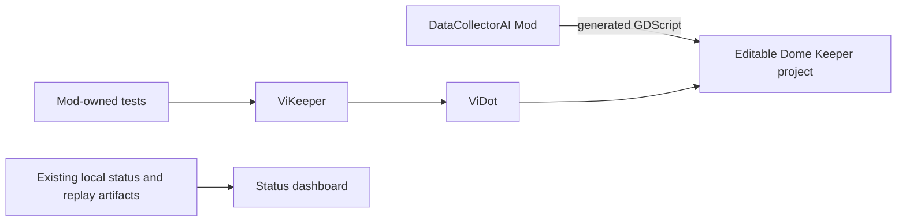
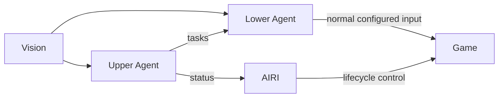

# Architecture

This document describes repository-level components and their relationships.
Each component owns its internal architecture in its own documentation.

## Current Repository Topology

| Component | Responsibility | Relationship |
| --- | --- | --- |
| `mods/LemonNekoGH-DataCollectorAI` | Active TypeScript-authored Dome Keeper Mod. | Generates the GDScript loaded by an editable Dome Keeper project. Its tests use ViKeeper. |
| `packages/vikeeper` | Dome Keeper-specific ViDot integration. | Supplies project launch policy to Mod-owned tests and composes ViDot. |
| `packages/vidot` | Generic Godot test runner. | Runs tests inside the explicitly configured editable Godot project. |
| `packages/status-dashboard` | Local observer for existing status and replay artifacts. | Has no active live or replay producer while the legacy collector is disabled. |
| `mods/LemonNekoGH-YoloDataCollector` | Retained legacy collector and rule teacher source. | Is not linked into current editable projects or workflows. |

The DataCollectorAI Mod owns its runtime design in its
[README](../mods/LemonNekoGH-DataCollectorAI/README.md). ViDot and ViKeeper own
their testing contracts in [ViDot](vidot.md) and their package READMEs.

## Target Runtime Topology

The AIRI host controls gameplay lifecycle outside the Agent control loop. Vision
supplies frame-derived state to both Agents. The Upper Agent produces gameplay
tasks and reports status; the Lower Agent turns tasks into normal configured game
inputs. The concrete Agent interfaces and Vision projections remain open.

Vision and model/dataset work are owned by [vision.md](vision.md). The future
AIRI plugin boundary is tracked by [roadmap.md](roadmap.md).
