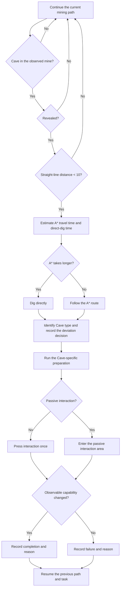

# Natural Cave Interaction Design

This document defines the intended behavior for opportunistic natural Cave
interaction. It is a design contract for simplifying the current rule teacher;
it does not claim that every current implementation path already follows this
model.

The teacher should treat a Cave as a short deviation from its current mining
path, not as a separate system with a full defensive state machine. Cave types
share encounter selection, approach choice, activation, outcome recording, and
return to the previous task. A Cave-specific branch supplies only preparation
that the game requires and the observable result that demonstrates success.

## Shared Interaction Flow

1. Consider only Caves in the currently observed mine.
2. Ignore a Cave until the game has revealed it.
3. Treat a revealed Cave as being passed only when its straight-line map
   distance from the keeper is less than the fixed threshold `10`.
4. Estimate the travel time of the shortest A* route to a reachable cell on the
   Cave boundary from path length and current movement speed.
5. Estimate the time to reach the Cave directly from the intervening tiles,
   current drilling strength, and movement time.
6. Use the A* route when it is no slower. Dig directly toward the Cave when the
   A* estimate is longer.
7. Identify the Cave type and record the decision before leaving the current
   path. The event must explain why the teacher deviated and which approach it
   chose.
8. Perform only the preparation required by that Cave type.
9. Press the configured interaction input once when the Cave is ready and
   focused. Skip the press only when the Cave's game interaction is passive.
10. Judge success from the smallest player-visible capability change for that
    Cave type.
11. Record completion or failure, including the observed state change and
    reason, then resume the path and task that were active before the deviation.

The estimators are decision aids, not independent correctness proofs. They need
only enough fidelity to choose between the two available approaches. Add more
model inputs only after a recording demonstrates a wrong approach decision.
The open-route estimate follows the project's existing A* path query; see the
[Godot AStar2D path-query reference](references.md#mod-development-and-godot-43).

## Decision Event

Choosing to interact is itself an event. Record `cave_interaction_decided`
before changing movement. Its evidence should be limited to what explains the
decision:

- Cave type and map position;
- straight-line distance and passing threshold;
- estimated A* and direct-dig times;
- selected approach;
- the reason for leaving the previous path.

Do not wait for successful activation and reconstruct this decision afterward.
The decision and its eventual outcome are separate observations.

## Cave-Specific Behavior

### Mushroom Cave

- Preparation: none.
- Activation: press the interaction input once.
- Success: the keeper's movement speed increased from the value observed before
  activation.

The teacher does not need to inspect Buff origin, amount, duration, cooldown,
last user, or other Mushroom Cave internals. Those details belong to the game's
implementation rather than the agent's behavioral result.

### Scanner Cave

- Preparation: search known cache positions for the nearest cache containing
  more than two iron resources, take exactly two iron resources, and bring them
  to the Scanner Cave.
- Activation: after delivering the required iron, press the interaction input
  once.
- Success: the map reveal distance increased from the value observed before
  activation.

Known caches are frame-derived teacher knowledge. The preparation must not
search hidden map state for iron or for another Cave.

Do not inspect, persist, or validate Scanner receiver internals by default. In
particular, receiver progress, `spent`, arrival counters, and animation phases
are not part of the interaction contract. If a real recording later shows that
the observable reveal-distance result is insufficient to diagnose or resume a
failed delivery, first add narrow telemetry for that demonstrated failure. Add
the smallest necessary receiver state only when the evidence proves it is
required.

### Helmet Cave

- Preparation: none.
- Activation: press the interaction input once.
- Success: the keeper's mine camera zoom changed from the value observed before
  activation.

The teacher does not need to inspect `hasHelmet` after activation or require a
particular zoom constant. The observable camera capability change is enough.

### Portal Cave

- Preparation: use an ordinary ore resource that the keeper is already
  carrying; otherwise take the nearest reachable ordinary ore from a known
  cache.
- Activation: carry the resource into the Portal's passive entrance. Do not
  press the interaction input.
- Success: the selected resource detached and the matching stored-resource
  inventory increased from the value observed before entering the Portal.

After one successful delivery, the teacher does not route to that Portal again.
It does not inspect Portal cooldown, overlap lists, gravity state, animation,
Drop identity history, or other receiver internals.

## Adding Another Cave Type

Keep the shared flow unchanged. Add only:

1. the minimum preparation that must occur before activation; and
2. one player-visible success observation.

Do not introduce Cave-specific routing, checkpoint fields, validation layers,
or interruption machinery unless an observed failure cannot be handled by the
shared mining, carrying, recording, and resume behavior.
