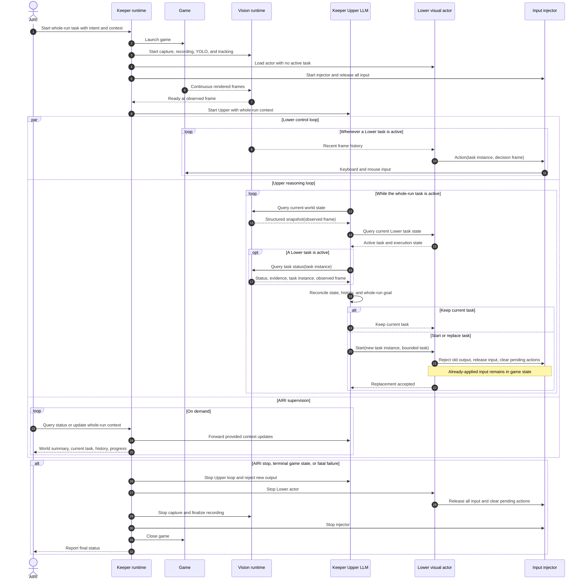

# Adopt a Multi-Timescale Gameplay Agent

## Context and Problem Statement

The integration combines long-term planning with real-time keyboard and mouse
control. The selected large language model (LLM) cannot provide both time
scales.

The project needs stable boundaries between AIRI, the Upper Agent, and the
Lower Agent.

## Decision

Use a three-level hierarchy: AIRI, an Upper Agent, and a Lower Agent.

The runtime obeys these rules:

- AIRI owns user intent, memory, and the whole-run task. Keeper handles runtime
  lifecycle and status.
- Vision supplies recent frames and YOLO-derived world state. It also returns
  task status and frame-derived evidence.
- The Upper Agent uses structured state, not screenshots, in its normal path.
  Only the Upper Agent can replace a Lower task.
- The Upper Agent runs a continuous tool loop without a timer or completion
  event. A state change does not restart an active inference.
- The Lower Agent executes one bounded task during Upper inference. One game
  has no more than one active Lower task.
- `start` replaces the active task without a queue or separate cancel operation.
  Replacement rejects old output, releases input, and clears pending actions.
- World state results include an observed-frame identifier. Actions and task
  results include a task-instance identifier. Consumers reject stale data.
- Applied input stays in the game. The next state query lets the Upper Agent
  correct its plan.
- Deployed Lower control uses operating-system input. In-game input is only for
  controlled tests or approved data generation.

### Runtime Sequence

Startup and shutdown occur once for each whole-run task. During play, the Upper
loop, Lower loop, and AIRI supervision operate concurrently. One frame stream
supplies all vision roles and configured recording.

The participants are logical roles. They do not require separate processes.

## Consequences

- Lower control continues during Upper inference.
- Fresh world state helps the Upper Agent correct long-term drift.
- Upper reaction time is no shorter than one Upper iteration.
- Applied input cannot be reversed after task replacement.
- Vision results can be missing, stale, or uncertain. The interfaces preserve
  `unknown`, observed-frame identifiers, and task-instance identifiers.

## Rejected Options

| Option | Reason for rejection |
| --- | --- |
| One model for both time scales | LLM latency blocks real-time control. |
| Synchronous Upper and Lower execution | Upper reasoning stops during Lower control. |
| Completion-event Upper loop | Event lifecycle rules make the Upper Agent a dispatcher. |
| Queued Lower tasks | The queue can run decisions from stale state. |

## References

- [Vision, Datasets, and Inference](../vision.md)
- [Hi Robot](https://www.pi.website/research/hirobot)
- [RT-H: Action Hierarchies Using Language](https://rt-hierarchy.github.io/)
- [SayCan](https://say-can.github.io/)

If Lower tasks cannot isolate real-time control from Upper inference, revisit
this decision. If AIRI cannot host continuous tool calling, revisit this
decision.
