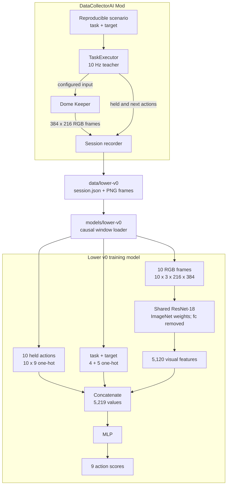

# Train Lower v0 with Automated Multitask Demonstrations

## Context

[ADR-0004](0004-adopt-a-multi-timescale-gameplay-agent.md) defines a visual
Lower Agent that executes one bounded task while the Upper Agent reasons. The
project needs a first learned Lower model and an aligned dataset before it can
measure that boundary.

The TypeScript-authored `LemonNekoGH-DataCollectorAI` Mod already contains a
10 Hz `TaskExecutor` and controlled proofs for Pickup, type-directed Drop,
Gadget Chamber activation, and Laser attack. These tasks collectively exercise
all configured actions currently returned by Quark Actions. Restricting the
first dataset to Pickup would save little collection infrastructure and would
make the structured task input constant. The decision is intentionally
pragmatic: with the common input, action, and automatic-execution contracts
already being fixed, Lower v0 includes the existing tasks.

The available training hardware is an Apple M5 Pro with 64 GB unified memory
and an RTX 3060 with 12 GB VRAM. The project does not use the VPT training route
under this resource constraint. Its causal behavior-cloning ideas remain useful.
Human demonstrations are not required because `TaskExecutor` generates the
demonstrations automatically.

## Decision

Train one Lower v0 action classifier with offline behavior cloning. At each
decision it predicts the next held-action class from recent RGB frames, past
held actions, and one closed structured task instruction. The CNN and MLP form
one jointly trained model.

### Architecture Overview

The diagram shows the selected automated collection and offline training flow.
It stops at the action scores because live inference and deployed control are
outside this decision.



### Initial Tasks and Targets

A Session stores its instruction as readable `task` and `target` strings. The
initial valid combinations are:

| Task | Valid targets |
| --- | --- |
| `pickup` | `iron`, `cobalt`, `water` |
| `drop` | `iron`, `cobalt`, `water` |
| `activate` | `gadget_chamber` |
| `attack` | `monster` |

This table is the complete initial instruction schema. It does not imply that
every task and target can be combined.

The task order is `pickup`, `drop`, `activate`, `attack`. The target order is
`iron`, `cobalt`, `water`, `gadget_chamber`, `monster`. The training loader
encodes each list as one one-hot vector and concatenates them, producing a
nine-value instruction input.

A target is a matching condition, not an object identity. Multiple objects may
match one instruction. The teacher can retain an exact runtime object to produce
a coherent demonstration and label its outcome, but the model does not receive
that reference. It uses the frame and action histories to continue its selected
route when more than one target matches.

### External Input and Action Contract

Batch dimensions omitted, each model input is:

| Input | Shape | Meaning |
| --- | --- | --- |
| RGB frames | `[10, 3, 216, 384]` | Ten chronological full-view frames |
| Held actions | `[10, 9]` | One one-hot held-action state for each frame |
| Instruction | `[9]` | Four task values followed by five target values |

Frames and decisions use a 10 Hz cadence. Ten frames span 0.9 seconds between
the oldest and newest observations. The collector knows and enforces this
external input contract even though it does not know the MLP layer layout.

The action-class order is fixed:

| Index | Action | Meaning |
| --- | --- | --- |
| 0 | `ui_up` | Hold the configured up action |
| 1 | `ui_down` | Hold the configured down action |
| 2 | `ui_left` | Hold the configured left action |
| 3 | `ui_right` | Hold the configured right action |
| 4 | `ui_select` | Hold the configured select action |
| 5 | `keeper1_pickup` | Hold the configured pickup action |
| 6 | `keeper1_drop` | Hold the configured drop action |
| 7 | `dome1_fire` | Hold the configured Laser fire action |
| 8 | `none` | Release the input held by this controller |

The class describes the desired held state, not an isolated key event. Repeating
a class preserves the held action. Only one class is active at a time, matching
the current teacher. A successful terminal decision supplies `none`; releases
caused by failure, interruption, timeout, or invalid capture are not supervised
success actions. The `none` class does not declare task completion.

### Causal Alignment

For decision `A_t`, the sample contains frames `F_(t-9)` through `F_t` and the
held-action states `H_(t-9)` through `H_t`. `F_t` is the latest completed frame
available before `A_t`. `H_i` is the action applied when `F_i` was captured,
before its associated decision. The input never contains `A_t`, a later frame,
or the Session outcome.

At Session start, missing frame positions repeat the first frame and missing
action positions use `none`. Windows never cross a Session boundary or a missing
observation. The collector stores each full Session; the training loader derives
overlapping windows instead of storing duplicated window data.

Task startup, compound-child transitions, input releases, and cancellation can
occur outside the 10 Hz decision grid. The Session preserves their actual order,
time, and physics-frame indices rather than inventing aligned timestamps.

### Model and Objective

One shared Torchvision ResNet-18 processes every frame. It starts from
`ResNet18_Weights.IMAGENET1K_V1`; its original ImageNet classification layer is
removed while its average pooling remains. Each frame produces 512 visual
features, so the ten frames produce 5,120 chronological visual features.

The MLP receives the 5,120 visual features, 90 held-action values, and nine
instruction values: 5,219 inputs in total. It produces nine action scores. The
MLP starts with random weights, and training updates both the ResNet-18 and MLP.
The number and width of MLP layers remain experiment configuration.

Preprocessing scales RGB values to `[0, 1]`, then normalizes channels with mean
`[0.485, 0.456, 0.406]` and standard deviation `[0.229, 0.224, 0.225]`. It keeps
the full 384-by-216 frame and does not apply the default 224-by-224 center crop.
Training and validation use identical preprocessing.

The objective is mean cross-entropy between the nine action scores and the
teacher action index. No reward, completion classifier, or reinforcement-learning
objective is part of Lower v0.

### Automated Collection and Storage

`LemonNekoGH-DataCollectorAI` owns Lower v0 collection. It constructs controlled,
reproducible scenarios, supplies a structured instruction, executes the matching
task through `TaskExecutor`, captures the external input contract, and writes the
Session. No additional collection Mod is introduced.

One Session is one complete task attempt, from its initial observation through
the terminal outcome and input release. The Mod writes an incomplete Session to
temporary storage and promotes it into the dataset only after successful task
completion and complete frame/action alignment. Failures, interruptions,
timeouts, and capture errors are reported but do not enter `data/lower-v0/`.

The dataset layout is:

```text
data/lower-v0/
  sessions/
    <session-id>/
      session.json
      frames/
        <frame-id>.png
```

Each `session.json` records:

- the schema version, Session identifier, instruction, and reproducible scenario
  configuration;
- the game and collector versions, configured input source, and key bindings;
- ordered steps with capture time, physics-frame index, frame identifier, the
  held action before the decision, and the teacher's next action;
- immediate lifecycle and input transitions with their real ordering; and
- the successful outcome, terminal time, and input release.

The PNG frame is an unannotated full 384-by-216 RGB game view without debug
overlays or a center crop.

Each whole Session is assigned to one dataset split before window construction.
Repeated captures of the same reproducible scenario remain in the same split.
Sampling and reporting are stratified by `(task, target)` so longer tasks and
more common resources do not silently dominate the model. Dataset size, split
proportions, and numerical balance targets remain experiment configuration.

### Project Ownership

Python training code lives in `models/lower-v0/` as a subproject managed by the
repository's mise-managed Python and uv environment. It uses the root `uv.lock`
and does not introduce a nested virtual environment or lockfile. Local Session
data lives under the ignored `data/lower-v0/` path.

Changing the external input contract requires corresponding collector and model
loader changes. Changing ResNet fine-tuning policy, MLP layout, optimizer, or
other model internals does not require a collector change. A checkpoint records
its schema version, preprocessing, task/target order, action order, and training
configuration so predictions are reproducible.

## Consequences

The first dataset provides training signal for the structured instruction and
positive examples for every current Quark Action output. It also combines
Keeper movement and interaction with Laser aiming and firing in one model; the
visual and instruction inputs must distinguish those contexts.

Session lengths and class distributions differ by task. Stratified sampling and
per-task, per-target, and per-class reporting make that imbalance visible.

When several objects match, the teacher demonstrates one valid route while
other routes can also be correct. Per-action accuracy therefore does not equal
task success. The first offline report includes held-out loss, action accuracy,
per-class results, class counts, `(task, target)` results, and a common-action
baseline. Gameplay success requires later execution on reserved scenarios and
must be reported separately before claiming task capability.

Raw Sessions remain reusable when the window length or internal model changes,
as long as the recorded observations still satisfy the new external contract.
Storing PNG frames and JSON metadata costs more space and loading work than
storing precomputed features, but preserves the evidence needed to test later
model changes.

## Open Experiment Configuration and Non-Goals

Dataset size, split proportions, MLP dimensions, optimizer, learning rate, batch
size, augmentation, and numerical acceptance thresholds are selected from pilot
measurements and recorded with each checkpoint.

Lower v0 does not use natural-language instructions. Its model inputs are
exactly the three tensors in the external input contract. Other Session fields
exist for selection, alignment, and reproduction, not as additional model
inputs. Fields not specified by this ADR are not implemented.

The Lower action dataset is separate from YOLO images and labels. Model loading,
an inference RPC, deployed operating-system input, and game-execution evaluation
are separate work. This decision does not redefine the task hierarchy or make
`MoveTo` a model-facing task.

## Alternatives

| Alternative | Tradeoff and reason for rejection |
| --- | --- |
| Train only Pickup first | It narrows scenario work, but leaves the task input constant and excludes positive examples for current actions whose collection path uses the same contract. |
| Train one model per task | Each model has a simpler condition, but duplicates the visual actor and cannot test the selected shared instruction-conditioned policy. |
| Use natural-language instructions | It can express future goals, but adds tokenization and grounding work that the closed initial task set does not require. |
| Use recurrent history processing | A recurrent model can summarize variable history, but Lower v0 first measures an explicit fixed window. |
| Store training windows or ResNet features directly | It can reduce loader work, but duplicates overlapping observations or binds the dataset to one internal model representation. |
| Create another collection Mod | It isolates recording code, but adds a runtime boundary around data already produced by `DataCollectorAI` and `TaskExecutor`. |
| Train the visual network from random weights | It removes reliance on photo pretraining, but discards a reusable initialization that can be measured during fine-tuning. |

## References

- [ADR-0004: Adopt a Multi-Timescale Gameplay Agent](0004-adopt-a-multi-timescale-gameplay-agent.md)
- [DataCollectorAI runtime design](../../mods/LemonNekoGH-DataCollectorAI/README.md#runtime-design)
- [Pickup implementation](../../mods/LemonNekoGH-DataCollectorAI/src/tasks/pickup_target_task.ts)
- [Drop implementation](../../mods/LemonNekoGH-DataCollectorAI/src/tasks/drop_by_type.ts)
- [Gadget Chamber activation implementation](../../mods/LemonNekoGH-DataCollectorAI/src/tasks/activate_gadget_chamber.ts)
- [Laser attack implementation](../../mods/LemonNekoGH-DataCollectorAI/src/tasks/attack_monster_task.ts)
- [Behavior cloning](https://imitation.readthedocs.io/en/latest/algorithms/bc.html)
- [ResNet-18 weights and preprocessing](https://docs.pytorch.org/vision/stable/models/generated/torchvision.models.resnet18.html)
- [PyTorch transfer learning](https://docs.pytorch.org/tutorials/beginner/transfer_learning_tutorial.html)
- [PyTorch one-hot encoding](https://docs.pytorch.org/docs/stable/generated/torch.nn.functional.one_hot.html)
- [Cross-entropy loss](https://docs.pytorch.org/docs/stable/generated/torch.nn.CrossEntropyLoss.html)
- [Godot physics tick rate](https://docs.godotengine.org/en/4.3/classes/class_engine.html#class-engine-property-physics-ticks-per-second)
