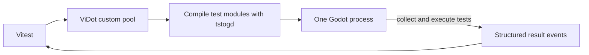

# ViDot

ViDot runs Vitest-shaped TypeScript tests inside Godot. The current proof uses
an editable Godot project and is exercised by `mise run vidot:test`.

## Current Flow



Vitest discovers candidate files and owns reporting. Node.js compiles those
files and launches Godot, but does not evaluate them or construct their test
trees. The Godot runner loads each generated module, builds the authoritative
tree from its registration calls, and executes the files sequentially.

The runner starts against the configured editable project, so the project's
settings and Autoloads are available. It replaces the normal main-scene entry
and begins collection after the first frame.

## Configuration

```ts
import { vidot } from '@vidot/vitest'
import { defineConfig } from 'vitest/config'

export default defineConfig({
  test: {
    fileParallelism: false,
    isolate: false,
    pool: vidot({ projectPath: './path/to/project' }),
  },
})
```

`godotPath` may be supplied to `vidot`; otherwise it resolves from `GODOT_BIN`
and then `godot`. Wrappers may supply a `launch` callback to add generic Godot
arguments, environment variables, and before/after process hooks; ordinary
ViDot use defaults to headless execution.

Vitest and `@vitest/runner` are pinned to 4.1.10 because the custom-pool API is
experimental. Godot 4.3.1 is the tested engine baseline.

Each project using ViDot has a root `tsconfig.json` solution that references
separate `tsconfig.node.json` and `tsconfig.godot.json` programs. The Node
program sets `customConditions: ["node"]` and includes the Vitest
configuration; the Godot program sets `customConditions: ["godot"]`, includes
tstogd's Godot typings, and includes the test sources. Both import
`@vidot/vitest`; conditional exports select the runtime-appropriate
implementation.

## Build and Compilation

The runner source is `packages/vidot/runtime/src/runner.ts`. The package build
converts it to the ignored `runtime/runner.gd`; `prepack` rebuilds that artifact
and includes it in the package. Tests use the packaged GDScript runner rather
than compiling it during a run.

A test module is adapted only where tstogd requires it:

- module-level executable statements are placed in a generated
  `vidot_collect(api)` method;
- every name from `@vidot/vitest` is bound to a Godot Callable while
  the original calls remain unchanged;
- a block-bodied arrow passed directly to a standalone registration call is
  first stored in an adjacent local variable because tstogd 0.1.3 does not emit
  that block correctly in argument position.

The retained authoring import emits no GDScript. All other supported syntax and
behavior comes from tstogd. ViDot does not rewrite assertions or helper control
flow.

## Current Test API

The current runner implements:

- `describe` and `test`;
- `beforeAll`, `beforeEach`, `afterEach`, and `afterAll`;
- `expect(...).toBe(...)` and `expect(...).toEqual(...)`;
- synchronous and asynchronous callbacks;
- a callback context containing the real Godot `SceneTree` as `tree`;
- `instantiate(path)` for instantiating an external GDScript file;
- `waitUntil(predicate, timeoutMs)` for frame-driven bounded waits.

`instantiate` records an assertion failure and returns `null` when the
script cannot be read, compiled, or instantiated. `waitUntil` evaluates the
predicate once per process frame and returns its final boolean state at the
deadline.

Matchers record failures and return a boolean. They do not stop the callback.
Tests that need fail-fast behavior use ordinary control flow:

```ts
test('example', () => {
  if (!expect(actual).toBe(expected))
    return

  continueTest()
})
```

Godot sends collected trees and results as structured stdout events. The Node.js
adapter rehydrates those records and uses Vitest's worker reporting channel;
Godot does not implement the Vitest worker protocol.

## Dome Keeper Integration

ViKeeper composes `vidot()` with Dome Keeper launch policy. ViDot remains
game-agnostic: it neither discovers a project nor owns a Mod fixture, game setup,
or assertion. ViKeeper receives the explicit editable project and Mod test root,
then supplies the headless or Movie Maker process policy. Each Mod owns its
fixtures, setup, and assertions. The ViKeeper package README owns its caller
contract and launch-mode details.

`mise run domekeeper:vidot:test` exercises the first DataCollectorAI Move proof.
